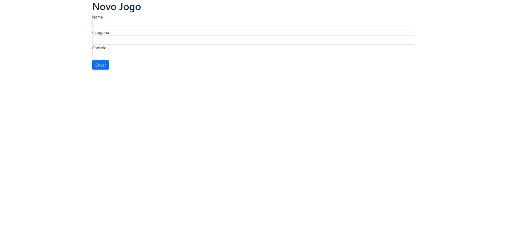

# Page Games

## Projeto realizado em Python com o framework

**Projeto se refere a criar página web com uma lista com informações sobre jogos**

## Passos realizados:

- Utilizar HTML para estruturação da página e CSS para estilo.
- Criar um script de python que gera as informações dos jogos, como nome do jogo, segmento, plataforma.
- O resultado final é um arquivo html com os dados preenchidos.

### Requisitos:

Tecnologias utilizadas:

- HTTP(GET, POST)
- HTML5
- CSS3
- Jinja
- Flask Framework (Python)
- [Bootstrap](https://getbootstrap.com/)

... projeto em desenvolvimento

Pagina de inicio

Cadastro de um novo jogo

